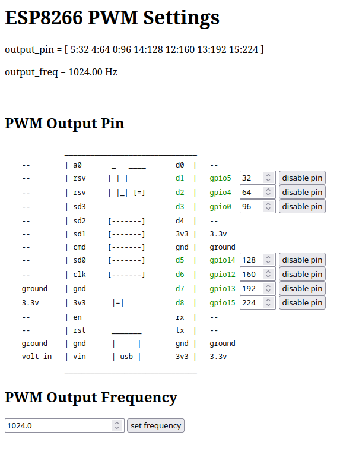

# esp_pwm
set pwm settings on a gpio pin from web interface for an esp8266

* blinks the ip address on led after connecting
* i made this to figure out the wiring of coax in my house by leaving the esp
  on one end and testing other ends with an oscilloscope
* web interface allows changing the pin used for pwm

## screenshot

